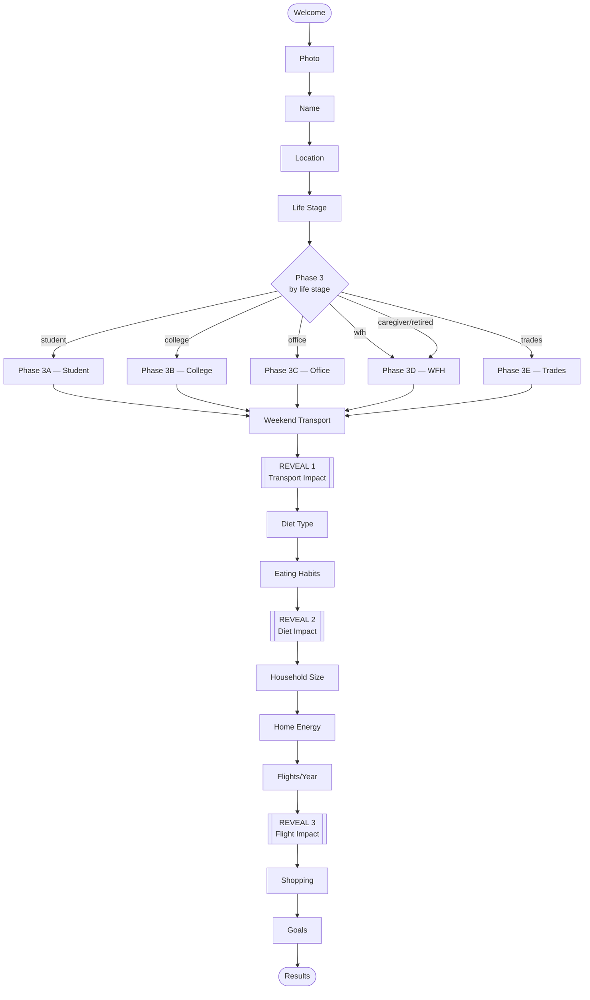

# 03 — Screen Flow

This file is the routing source of truth. If a screen file in `04-screens/` says "next: Diet" but this file disagrees, **this file wins**.

---

## High-level diagram

---

## Decision table

Every conditional in the flow. Read in order; first match wins.

| From screen | Condition | Go to |
|---|---|---|
| Welcome | always | Photo |
| Photo | always (Skip also goes here) | Name |
| Name | always | Location |
| Location | always | LifeStage |
| LifeStage | `answers.lifeStage == 'student'` | Phase3A.Mode |
| LifeStage | `answers.lifeStage == 'college'` | Phase3B.Housing |
| LifeStage | `answers.lifeStage == 'office'` | Phase3C.Mode |
| LifeStage | `answers.lifeStage == 'wfh'` | Phase3D.Errands |
| LifeStage | `answers.lifeStage == 'trades'` | Phase3E.Mode |
| LifeStage | `answers.lifeStage == 'caregiver' \|\| 'retired'` | Phase3D.Errands |
| Phase3A.Mode | `answers.transportMode in ['walk','bike']` | Phase3A.Days (skip distance) |
| Phase3A.Mode | else | Phase3A.Distance |
| Phase3A.Distance | always | Phase3A.Days |
| Phase3A.Days | always | Weekend |
| Phase3B.Housing | always | Phase3B.Mode |
| Phase3B.Mode | `answers.transportMode in ['driveAlone','carpool']` | Phase3B.Fuel |
| Phase3B.Mode | else | Phase3B.Distance |
| Phase3B.Fuel | always | Phase3B.Distance |
| Phase3B.Distance | always | Weekend |
| Phase3C.Mode | `answers.transportMode in ['driveSedan','driveSUV','carpool','motorcycle','ev']` | Phase3C.Fuel |
| Phase3C.Mode | else | Phase3C.Distance |
| Phase3C.Fuel | always | Phase3C.Distance |
| Phase3C.Distance | always | Phase3C.Days |
| Phase3C.Days | always | Weekend |
| Phase3D.Errands | `answers.transportMode == 'drives'` | Phase3D.Vehicle |
| Phase3D.Errands | else (`walkBike` or `rarely`) | Weekend |
| Phase3D.Vehicle | always | Weekend |
| Phase3E.Mode | always | Phase3E.Days |
| Phase3E.Days | always | Weekend |
| Weekend | always | Reveal1 |
| Reveal1 | always | Diet |
| Diet | always | EatingOut |
| EatingOut | always | Reveal2 |
| Reveal2 | always | Household |
| Household | always | Energy |
| Energy | always | Flights |
| Flights | always | Reveal3 |
| Reveal3 | always | Shopping |
| Shopping | always | Goals |
| Goals | always | Results |
| Results | always (single CTA "Finish") | end of onboarding (out of scope) |

---

## Per-branch screen count (for progress bar)

The progress bar's denominator is **dynamic** — it depends on which life-stage branch the user is in, and whether they triggered the fuel sub-screen. Compute it as soon as enough answers are available; until then default to the maximum (15).

| Branch | Total screens (excluding Welcome, Reveals, Results) |
|---|---|
| Student | 10 (Photo, Name, Location, LifeStage, Mode, Distance*, Days, Weekend, Diet, EatingOut, Household, Energy, Flights, Shopping, Goals) — see note |
| College | 11 |
| Office | 12 (max) |
| WFH | 9 or 10 |
| Trades | 10 |

**Note**: Reveals and Results are not counted in the progress bar. The progress bar represents "questions remaining," not "screens remaining." The Results screen has no progress bar.

Reference numbers, rounded for clarity in the bar label:

- Student: bar reads `"3 of 13"` etc. through 13 total.
- College: 14 total.
- Office: 15 total.
- WFH (no driving): 12 total.
- WFH (drives): 13 total.
- Trades: 13 total.

Treat these as the displayed denominator. If your build computes a different number, recalculate using this rule: **count every screen between Welcome and Results that takes user input** (so a Reveal screen is *not* counted, but Photo is even if skipped).

---

## Routing implementation notes

- All routing decisions live in each screen's `onContinue` handler, not in a central router. The handler reads `answers` from app state and calls `navigate(targetRoute)`. This keeps the routing graph readable and matches the per-row "Condition → Go to" decision table above.
- The Phase 3 entry is a virtual node — you don't need a "Phase3" screen. The Life Stage screen's `onContinue` jumps directly to the correct branch's first screen.
- After a Reveal screen, the user cannot go back to re-answer the prior phase (one-way doors). Other screens allow a back button in the top-left.
- The Welcome screen has no back button. The Results screen has no back button.

---

## State persistence

Save `answers` to `localStorage` under key `climate_onboarding_v1` on every change. On app load, if a saved object exists and is partially complete, resume at the first incomplete screen. If complete, go straight to Results. Provide a "Start over" link only on the Welcome screen if a saved object is detected.
